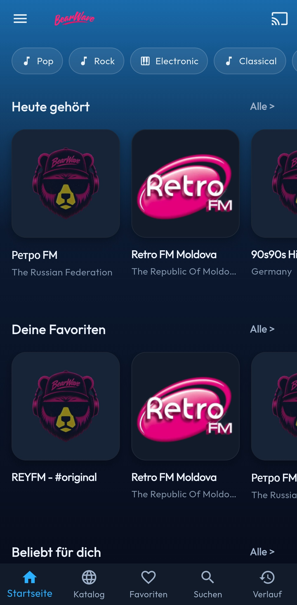
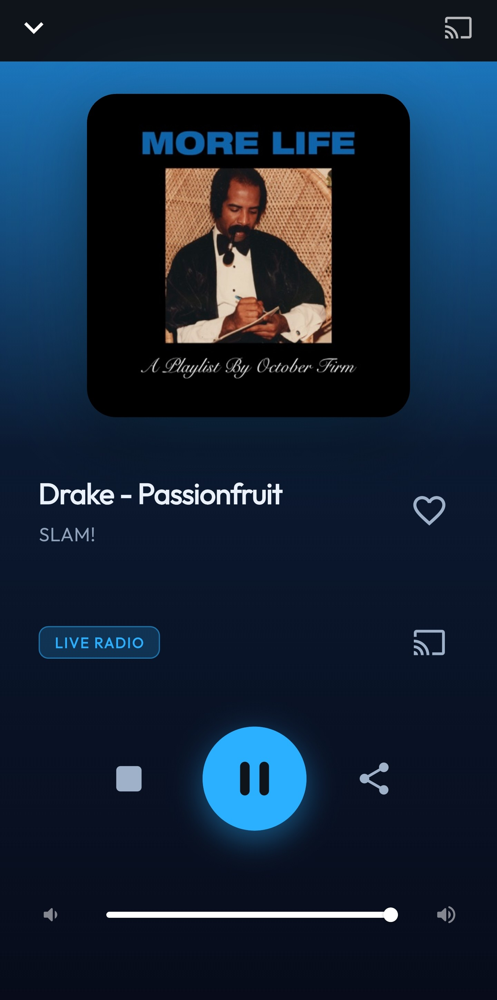
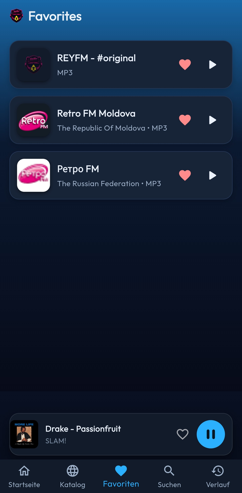
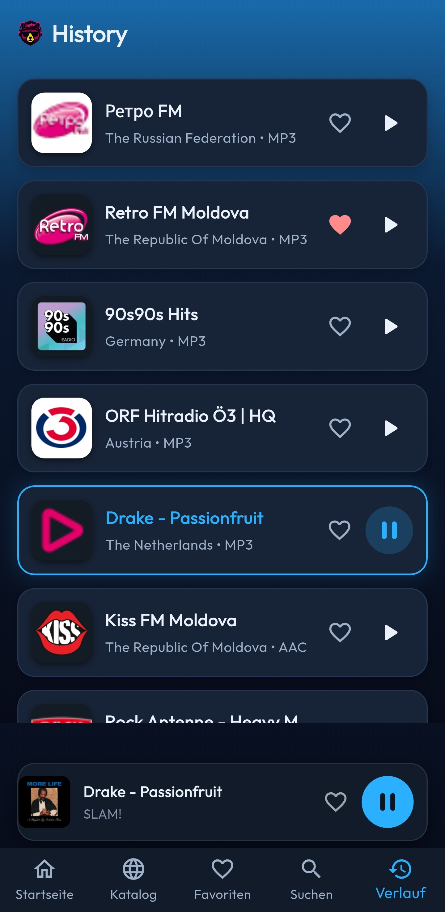
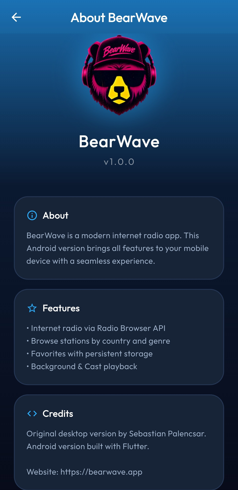
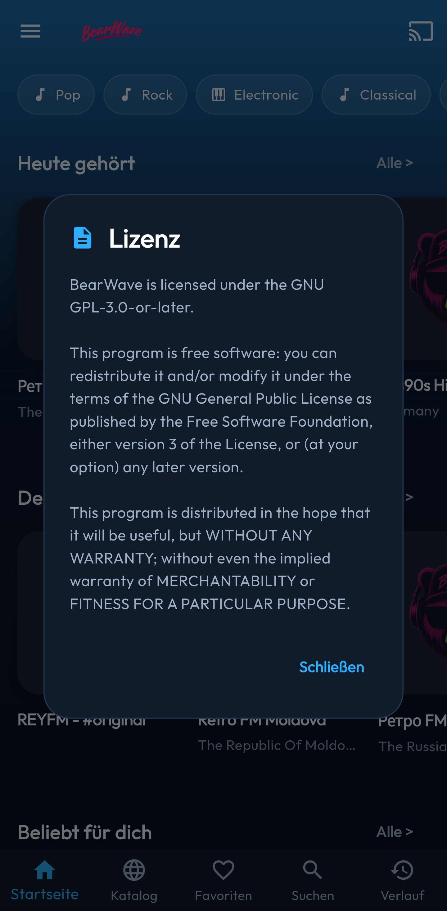

# BearWave Android

BearWave is a modern internet radio streaming app for Android, built with
Flutter. It features a clean design inspired by the KDE desktop environment,
full Android Auto integration, Google Cast support, and dynamic metadata/cover
art loading.

This is the official Android counterpart to the original Linux/KDE desktop
version at https://github.com/spalencsar/bearwave.

[](LICENSE)
[](https://flutter.dev)

## Features

- Internet radio via the Radio Browser API
- Browse stations by Top, Germany, Netherlands
- World view with country grid and genre tags
- German, English, and Dutch country names matching the selected app language
- Local search and filtering by name, genre, country, localized country name,
  and ISO code
- Sorting by name, bitrate, votes
- Favorites with persistent storage
- Manual station add
- Resume last station and volume
- Background playback support
- **Android Auto** integration with browsable Top, localized Worldwide
  countries, Favorites, Recent, and search results
- Android Auto Now Playing support via MediaSession metadata, queue, playback state, and media callbacks
- Radio Browser retry/failover with a persistent last-known-good country list
- High-resolution station artwork discovery plus KDE-style initials for
  missing or low-quality logos
- **Google Cast / Chromecast** support (stream directly to smart speakers)
- Dark theme matching the KDE desktop app

## Screenshots

<p align="center">
  
  
  
</p>
<p align="center">
  
  
  
</p>


## Quick Start

### Prerequisites

- Flutter SDK 3.44.6 (pinned in `.flutter-version`)
- Dart SDK >= 3.12.1
- Java 17 (JDK 17 OpenJDK)
- Android SDK

### Installation

```bash
# Clone the repository
git clone https://github.com/spalencsar/bearwave-android.git
cd bearwave-android

# Install dependencies
flutter pub get

# Run on connected device
flutter run
```

### Build APK

```bash
# Debug APK
flutter build apk --debug
# Output: build/app/outputs/flutter-apk/app-debug.apk

# Release APK
flutter build apk --release
# Output: build/app/outputs/flutter-apk/app-release.apk
```

### Android Auto Testing

For real car head units, prefer a release APK. Debug or shell-installed builds
can be filtered differently from DHU tests.

```bash
flutter build apk --release
adb install -r -i com.android.vending build/app/outputs/flutter-apk/app-release.apk
```

The Android Auto experience is served by `BearWaveAudioHandler` through
`audio_service` / `MediaBrowserService`. It exposes browsable radio categories,
localized country folders, search results, MediaSession metadata, logical
queues, favorite controls, and prepare/play callbacks for the Now Playing
screen.

### Arch Linux Setup

```bash
# Install Java 17
sudo pacman -S jdk17-openjdk

# Configure Flutter to use Java 17
flutter config --jdk-dir /usr/lib/jvm/java-17-openjdk

# Verify setup
flutter doctor
```

## Tech Stack

| Layer | Technology |
|-------|-----------|
| Framework | Flutter (Dart 3.12+) |
| State Management | Provider + ChangeNotifier |
| Audio Playback | just_audio |
| Background Audio | audio_service |
| HTTP Client | http |
| Persistence | SharedPreferences |
| Cast Support | cast_plus |
| Image Caching | cached_network_image |
| API | Radio Browser API |

## Architecture

```
RadioBrowserApi (HTTP) → Providers (State) → Screens/Widgets (UI)
SharedPreferences ← StorageService ← Providers
BearWaveAudioHandler (audio_service + just_audio) → PlayerProvider → PlayerBar / StationCard
CastService (cast_plus) → PlayerProvider / CastDialog
```

## Project Structure

```
lib/
├── main.dart
├── app.dart
├── l10n/
│   ├── country_names.dart
│   └── translations.dart
├── models/
│   ├── radio_station.dart
│   └── country.dart
├── providers/
│   ├── settings_provider.dart
│   ├── stations_provider.dart
│   └── player_provider.dart
├── screens/
│   ├── home_screen.dart
│   ├── world_screen.dart
│   ├── favorites_screen.dart
│   ├── history_screen.dart
│   ├── about_screen.dart
│   ├── expanded_player_sheet.dart
│   └── station_search_delegate.dart
├── services/
│   ├── radio_browser_api.dart
│   ├── bearwave_audio_handler.dart
│   ├── cast_service.dart
│   ├── cover_art_service.dart
│   ├── now_playing_state.dart
│   ├── station_artwork_service.dart
│   └── storage_service.dart
├── theme/
│   └── bearwave_theme.dart
└── widgets/
    ├── station_card.dart
    ├── station_logo.dart
    ├── station_square_card.dart
    ├── player_bar.dart
    ├── cast_dialog.dart
    ├── country_grid.dart
    ├── genre_chips.dart
    ├── search_bar.dart
    └── add_station_dialog.dart
```

## API

BearWave uses the [Radio Browser API](https://api.radio-browser.info/) through
`all.api.radio-browser.info`. It dynamically discovers valid Radio Browser
nodes, retries transient network and HTTP 429/502/503/504 failures up to three
times, temporarily avoids failed nodes, and keeps a persistent last-known-good
country list for the Flutter catalog and Android Auto.

## Current Status

- The current suite contains 44 tests covering settings, station
  parsing/preferences, metadata invalidation, station artwork, Radio Browser
  resilience, country localization, and the application smoke test.
- The debug APK builds successfully and has been validated on a Samsung S24 Ultra.
- The Android Auto playback/control fixes and the 1.1.0 follow-up changes
  passed DHU, Flutter-device, and real-vehicle testing.
- The 1.1.1 release-only Android Auto resource-retention fix passed analysis,
  all 44 tests, signed-APK inspection, smartphone testing, and DHU testing.
  A separate real-vehicle confirmation for 1.1.1 is still pending.

## Contributing

See [CONTRIBUTING.md](CONTRIBUTING.md) for guidelines.

## License

This project is licensed under the GNU GPL-3.0-or-later. See [LICENSE](LICENSE) for details.

## Credits

- Original desktop app by Sebastian Palencsar
- Radio Browser API by radio-browser.info
- Built with Flutter
